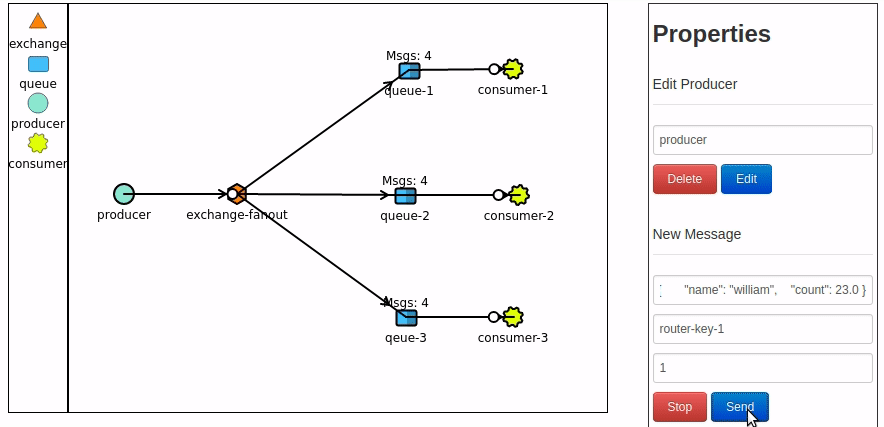

# Aprendendo RabbitMQ

RabbitMQ é um software de mensageria que trabalha com enfileiramento e troca de mensagens entre processos, aplicativos
e servidores de forma assíncrona. 

RabbitMQ é amplamente utilizado ao ser trabalhar com mensagens em protocolos AMQP

##### Rodando RabbitMQ
Antes de subir os app de producer e consumer em alguma IDE de sua escolha rode o serviço de RabbitMQ com docker 
no script abaixo.
```
$ ./ rabbitmq-run.sh
```
O que esse script faz: 
 - faz pull da imagem do rabbitmq no dockerhub;
 - abre as portas 15672 e 5672(15672 para acesso do browser e 5672 para comunicação de api e servidor amqp);
 - define usuario e senha de acesso ao serviço (Login:user/senha:password);

Temos um exemplo em docker-compose onde já sobe um ambiente já construindo dois containers do app e um container com RabbiqMQ.
O exemplo mostra um payload de pagamento gerado no producer por scheduler, enviando esse payload a uma fila no RabbitMQ e o consumo desse payload no consumer
que fica escutando toda vez que uma nova mensagem chega a fila do RabbitMQ.

```
$ ./ cluster-example/cluster-run.sh
```   

##### Interface de Gerenciamento do RabbitMQ
 Acessando o browser na porta localhost:15672 e digitar login e senha:
 
 
 
 Teremos acesso aos diversos recursos e métricas que o rabbitmq dispõe como queues, exchanges, routers, métricas 
 e entre outros:
 


 
## Conceitos AMQP
O envio e consumo de mensagens no rabbitmq consiste em um producer e um consumer. Basicamente funciona da seguinte
 forma:


 - **Message**: algum dado podendo ser json, xml e até stream;
 - **Producer**: alguma aplicação envia a mensagem para o serviço;
 - **Exchange**: recebe a mensagem e encaminha para uma queue através de rotas baseando-se nas regras defindas pelo tipo
  de exchange;
 - **Queue**: armazena mensagens vindas das exchanges até que seja consumida;
 - **Consumer**: Aplicação fica escutando nas queue buscando mensagens e processando-as;
 


 - **Connection TCP**: comunicaçao entre aplicação e RabbitMQ;
 - **Channel**: comunicação virtual sob TCP Connection. Todo producer e consumer é feito por channel;
 - **Binding**: link entre um exchange e queues. Ele determina para quais queues uma mensagem pode ser roteado podendo 
 ser zero queue ou muitos qeues; 
 - **Router Key**: faz parte do cabeçalho de cada mensagem e garante que a mensagem será enviada para a fila correta 
 como se fosse um endereço de entrega;


## Exchange

As mensagens encaminhados pelo produtor não vai direto para uma fila, tem que passar primeiro por um exchange.
As exchange são agentes de mensagem definidos por um host virtual no RabbitMQ. Exchange roteia as mensagens para zero ou
muitas filas com a ajuda de configuraçoes como header attributes, bindings e routing keys. 

As exchanges, connectins e queues podem ser confiugrados como durável, temporário e exclusão automática na criação:

 - **Durable**: uma exchange durável pode sobreviver a uma reincialização de servidor e podem durar até serem excluídos 
de forma explícita;
 - **Temporary**: uma exchange temporária pode durar até que o servidor seja reiniciado;
 - **Auto Delete**: uma exchange apaga automaticamente quando o último objeto vinculado a ele é desvinculado. 

##### Exchange Types

 - **[Fanout](https://www.rabbitmq.com/tutorials/tutorial-three-spring-amqp.html)**:
 Uma exchange envia uma mensagem do producer a vários queues vinculados a essa exchange. Um exchange 
 fanout não utiliza router keys para rotear mensagem as filas pois apenas considera o binding entre a exchange e as varias
 filas vinculadas.

 

 - **[Direct](https://www.rabbitmq.com/tutorials/tutorial-four-spring-amqp.html)**:
 Uma exchange envia uma mensagem do producer a uma queue baseado no router key encontrado no header
 da mensagem.
 

 
 
 - **[Topic](https://www.rabbitmq.com/tutorials/tutorial-five-spring-amqp.html)**: 
 Uma exchange topic diferente do tipo direct não utiliza router-key de forma arbitrária. Deve ser utilizado 
 uma lista de palavras delimitados por pontos que criará chaves de roteamento. Normalmente pode ser qualquer palavra, 
 porém por padrão deve-se adotar palavras dentro de um contexto de quem as consome. Essa chaves de roteatmento são parecidos
 com exchange direct, porém as direct são limitadas. Com o exchange topic é possível fazer roteamento com base em critérios.
 O exemplo a seguir mostra o envio de mensagem no tópico `message.gmail` com o critério de envio de email ao gmail. Porém
 existe a chave `message.*` com critério de obter todas as mensagens enviados para qualquer consumer sendo gmail ou outlook. 
  
   (*) pode substituir exatamente uma palavra.
   
   (#) pode substituir zero ou mais palavras.
 
  
 
 
 - **[Dead Letter](https://www.rabbitmq.com/dlx.html)**: 
 Existe situaçoes em que uma exchange não consegue entregar mensagem para uma fila. Nesse caso a 
 mensagem podeŕa ser descartada silenciosamente. O RabbitMQ fornece uma extensão AMQP conhecida como "Dead Letter Exchange",
 onde fornece a funcionalidade de captura de mensagens não entregues possibilitando com que essa mensagem seja tratada ou 
 por um adminstrador ou por algum outro processos automatizado de correção.


 #### Queue
 São responsáveis por armazenar as mensagens vindas do producer. Os consumidores se conectam a elas para 
 obter mensagens. 
 
 - **Durable**: fila sobreviverá a uma reinicialização do servidor;
 - **Exclusive**: usado apenas por uma conexão e a fila será excluída quando a conexão for fechada;
 - **Auto-delete**: a fila que teve pelo menos um consumidor é excluída quando o último consumidor é desconectado;
 - **Arguments**: opcional; usado por plug-ins e recursos específicos do servidor, como TTL de mensagem, 
 limite de comprimento da fila, etc;
 
                               
## Referências
 - https://www.rabbitmq.com/tutorials/amqp-concepts.html
 - https://www.rabbitmq.com/getstarted.html
 - https://www.rabbitmq.com/queues.html
 - https://www.cloudamqp.com/docs/index.html
 - https://www.cloudamqp.com/blog/2015-09-03-part4-rabbitmq-for-beginners-exchanges-routing-keys-bindings.html
 - http://tryrabbitmq.com/
